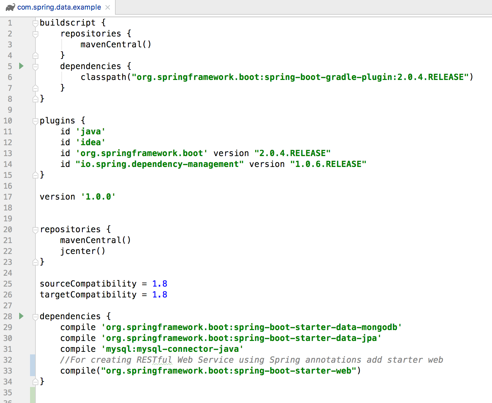
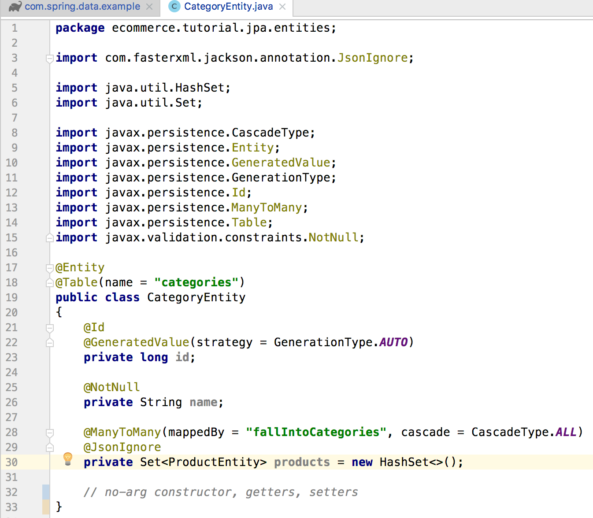
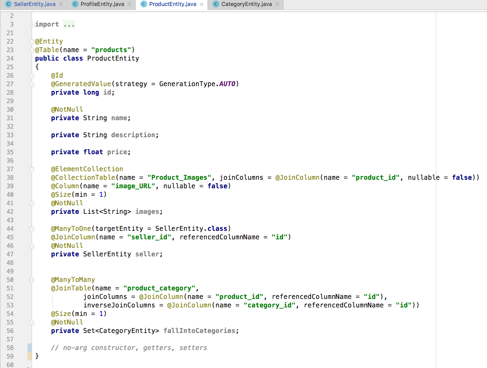
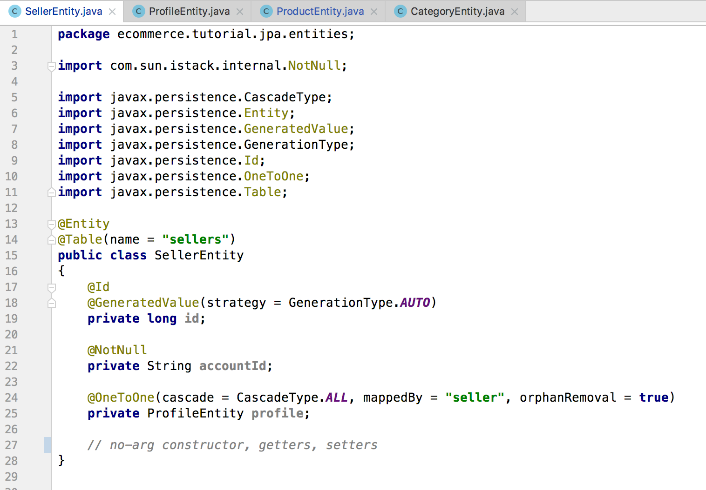
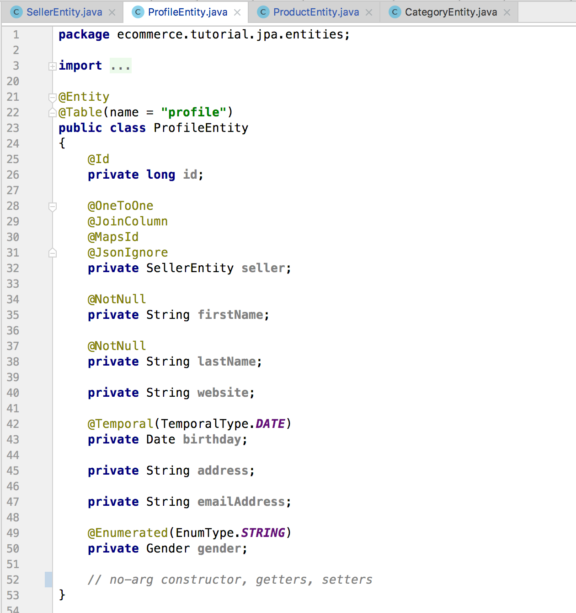
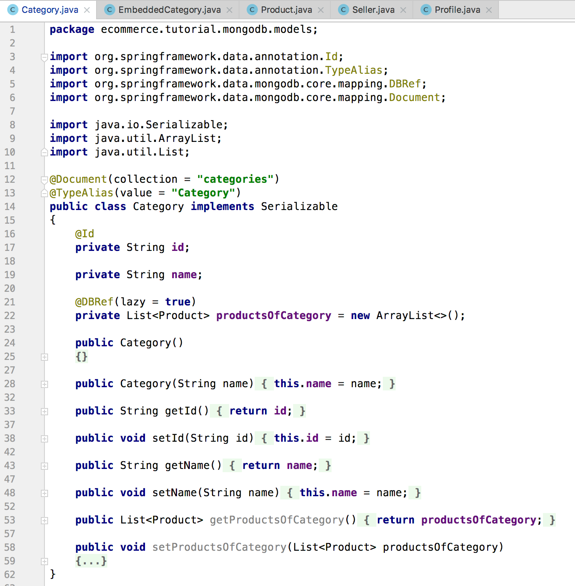
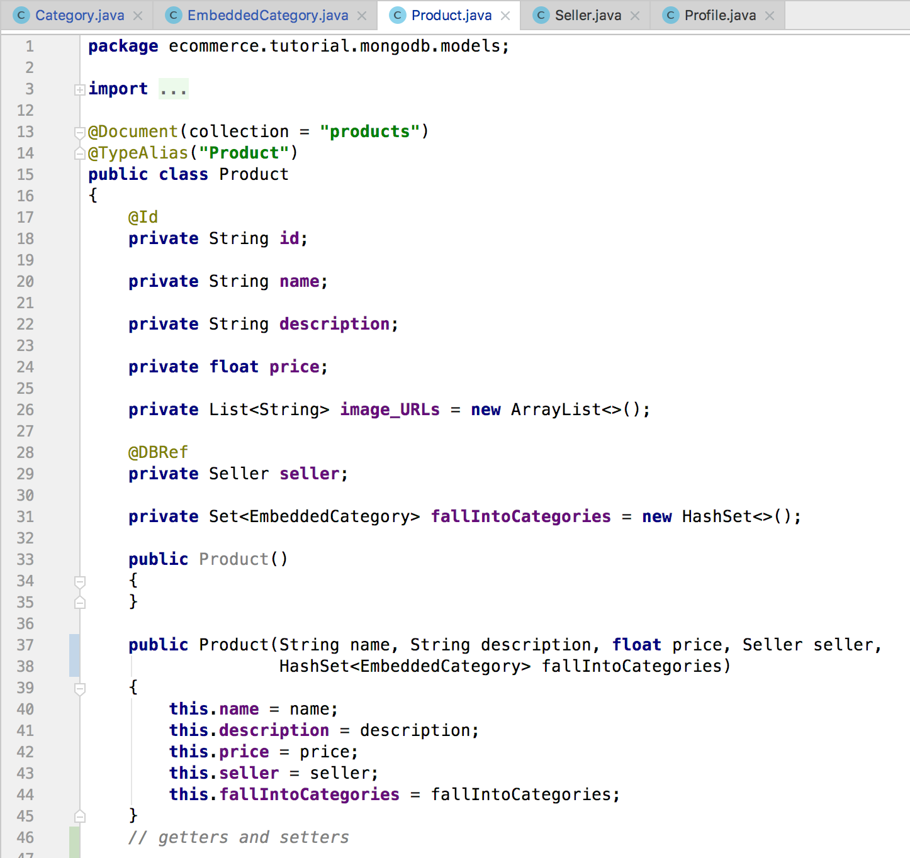
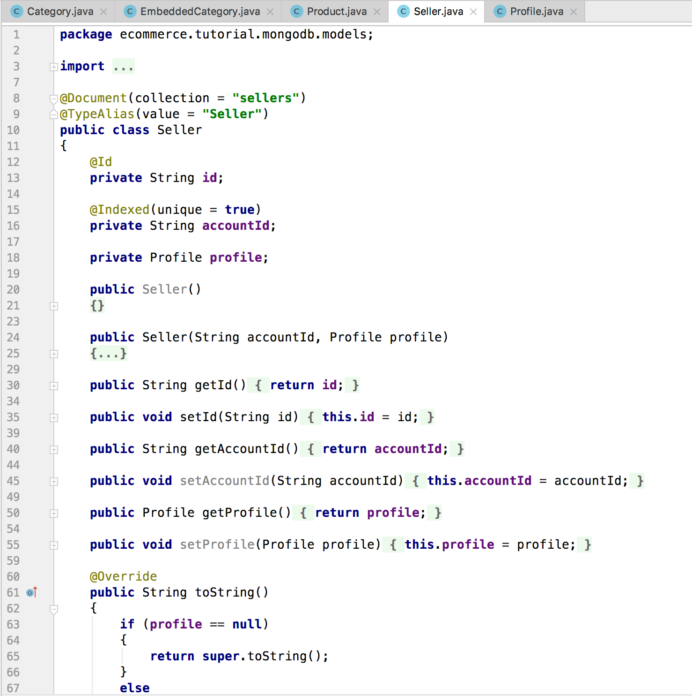
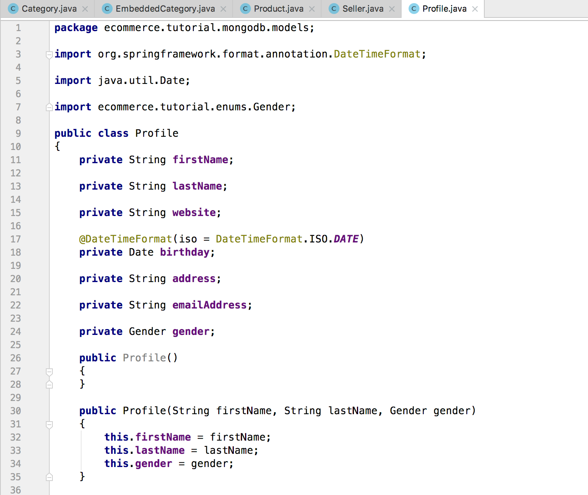

# 1. Introduction
In this tutorial we will show how to model different kinds of relationships between data domains using Spring Data JPA and Spring Data MongoDB.

We consider a simple data model for an e-commerce application and create database schemas for both MongoDB and MySQL databases. Then we create three RESTful services to test the databases. We will run our application with Spring Boot and Gradle tool.

MongoDB is a NoSQL technology which stores the data in JSON like structure documents. As we all know document-based databases has fundamental difference to relational databases. In this tutorial we design the MongoDB schema the same as MySQL schema for the purpose of showing difference.
So maybe you have better choices in modeling relationships when designing your database schemas.

# 2. Requirements
The technologies used in this tutorial will be as follows:
* Spring Boot 2.0.4
* Spring Data JPA 2.0.9
* Spring Data MongoDB 2.0.9
* MySQL 8.0.11
* MongoDB 4.0.0
* Gradle 4.8.1
* Java 1.8.0_172
* Insomnia 6.0.2
* MongoDB Compass 1.14.6

# 3. Project Dependencies
The build.gradle file in our project includes dependencies for Spring Boot Starter Web, Spring Data MongoDB and Spring Data JPA. You can use Spring Initializer to start your Spring Boot application. This is a web tool Spring provides to bootstrap an application quickly. You’ll download the project file and then can open it in IDEA. Access the Spring Initializer at [SPRINGINITIALIZER](https://start.spring.io).

The build.gradle file will look as shown below.



# 4. Project Structure
Create folders we'll need for implementing project. We'll have four folders inside 'ecommerce.tutorial' package.

*Folder controllers*: We put our RESTful services in this folder.

*Folder enums*: We put our enumeration classes in this folder.

*Folder jpa*: We put entities and repositories for MySQL database in this folder.

*Folder mongodb*: We put models and repositories for MongoDB database in this folder.

Add package 'resources' and create 'application.properties' file in this package. We'll write configuration for our databases here in the next sections.

Add 'Application.java' file inside 'ecommerce.tutorial' package.


 └── src

	 
    └── main
        └── java		
            └── ecommerce.tutorial
                └──controllers
                    └── CategoryService.java
                    └── ProductServcie.java
                    └── SellerServcie.java


# 5. A Sample Data Model for the Project
We suppose a simple e-commerce app which includes Sellers and their Products. We’ll consider these scenarios:

A Seller has a Profile (Suppose we’d like to store sellers’ information separately because the Profile will have relation with another class).

A Seller has some Products for selling.

All Products organized in Categories.

A Product can fall into a/some Categories.

Each Category has some Products.


# 6. MySQL Database
##  a. Instal MySQL
We’ll install MySQL using homebrew:

Download MySQL: brew install mysql

Start a mysql shell (using root user): *mysql -u root -p*

Create a new database instance: *create database my_sql_db_ecommerce_tutorial;*

Check the databases: *show databases;*

Create a new user: *create user 'tutorialuser'@'localhost' identified with mysql_native_password by 'TutorialUser_Password';*

Give permission to this user: *grant all privileges on my_sql_db_ecommerce_tutorial.\* to 'tutorialuser'@'localhost';*

Check the user: *select user, host, show_db_priv from mysql.user;*

Change to the database we just created: *use my_sql_db_ecommerce_tutorial;*

## b. MySQL Configuration in 'application.properties'
In 'application.properties' file add the following configuration:
```
spring.jpa.hibernate.ddl-auto=update
spring.datasource.url=jdbc:mysql://localhost:3306/my_sql_db_ecommerce_tutorial
spring.datasource.username=tutorialuser
spring.datasource.password=TutorialUser_Password
```
## c. Create Data Domains using Spring Data JPA
Let’s now create the first data entity in our relational database called Category. Create a new package called 'entities' inside 'ecommerce.tutorial.jpa' and add a class named 'CategoryEntity.java'.

Our Category entity has two fields:

 - id: It’s the primary key for Category table.
 - name: The name of the Category.



All of our domain models must be annotated with @Entity annotation. 

The @Entity annotation used to mark the class as a persistent Java class. All of classes with this annotation will map to a table in database.

The @Table annotation used to name the table in database, which the entity mapped to. If this annotation is not provided, then the class name will be used as the table name.

The @Id annotation tells spring that this field will be used as the primary key of the table.

The @GeneratedValue annotation is used to specify how the primary key should be generated. Here strategy indicate that the id should be generated automatically.

The @NotNull annotation uses on a parameter that must not be null. We also can use [Nullability Annotations](https://docs.spring.io/spring-data/jpa/docs/current/reference/html/#repositories.nullability.annotations) of spring framework to constraint fields.

All of the data models will have no-argument constructor. The default constructor only exists for the sake of Spring Data modules.

Create Product entity and Seller entity with following contents:





Create 'SellerEntity.java' inside 'entities' folder. Our Seller class has two fields. The id is the primary key for sellers table and accountId is a String each seller uses let say for example to signing-in.

Our Product class has four fields for id (primary key), name, description and price of the product.

Create Profile entity which contains attributes for Sellers. Here we have seven fields.

 - id: It’s the primary key for Profile table.
 - firstName: The first name of a Seller
 - lastName: The last name of a Seller
 - website: The website address of a Seller which is not a required field.
 - birthday
 - address
 - emailAddress
 - gender

Notice\????The point in profile entity for id field is we can make use of Seller ids in Seller table as a primary key in Profile table due to there is one-to-one relationship between Profile and Seller. So, in ProfileEntity we don’t annotate id with @GeneratedValue annotation since the identifier is populated with the identifier of the Seller entity.



The @Temporal annotation is used to converts the Date type value from Java to compatible Date format in SQL database and vice versa. We specified type of value by TemporalType element due to @Temporal is used for both java.util.Date and java.util.Calendar classes.

All the properties which left unannotated will be mapped to columns in tables that share the same name and same type as the properties themselves.

#### **One-To-Many relationship**
A one-to-many relationship is where an object (parent/source/owner of relation) has an attribute that stores a collection of another objects (child/target of relation). Here in our sample data model we have one-to-many relationship between Products and Product_Images. It means each product can have a/some image(s). We suppose images save by their URLs. So, the Product entity must have an attribute that stores a collection of strings (URL addresses).
An ElementCollection can be used to define a one-to-many relationship to an Embeddable object, or a Basic value (like String). We implement relationship between product and its images using @ElementCollection annotation.

```
@ElementCollection
@CollectionTable(name = "Product_Images", joinColumns = @JoinColumn(name = "product_id", nullable = false))
@Column(name = "image_URL", nullable = false)
@Size(min = 1)
@NotNull
private List<String> images;
```
Another method to define a one-to-many relationship is using @OneToMany annotation. @OneToMany makes relation between two entities. Here in our sample we don’t need query image URLs directly i.e. we implement one-to-many using ElementCollection. For other examples on how to define one-to-many relationship see [Java Persistence/OneToMany](https://en.wikibooks.org/wiki/Java_Persistence/OneToMany#Unidirectional_OneToMany,_No_Inverse_ManyToOne,_No_Join_Table_(JPA_2.x_ONLY)).

#### **Many-To-One relationship**
In a many-to-one relationship an object (parent/source/owner of relation) has an attribute that reference another object (child/target of relation). Here in our sample data in the Product entity we store a reference to the Seller who sells it.

```
@ManyToOne(targetEntity = SellerEntity.class)
@JoinColumn(name = "seller_id", referencedColumnName = "id")
@NotNull
private SellerEntity seller;
```

#### **One-To-One relationship**
PSeller has a field (profile) that has a one-to-one relationship with Profile's seller field. That is, each seller has exactly one profile, and vice versa. The @OneToOne annotation defines this relationship. The non-owning side (here Profile \?????here) must uses the mappedBy element of the @OneToOne annotation to specify the relationship property of the owning side (mappedBy = "seller").

Code of SellerEntity as the source of one-to-one association:
```
@OneToOne(cascade = CascadeType.ALL, mappedBy = "seller")
private ProfileEntity profile;
```
The source must use cascade element of the @OneToOne annotation to specify which operations must be cascaded to the target of the association.

Code of ProfileEntity as the target of one-to-one association:
```
@OneToOne
@JoinColumn
@MapsId
private SellerEntity seller;
```
The Profile can use the identifier of Seller as primary key, so we assumed they share the same primary key values. The @MapsId annotation provides the mapping for primary key.

#### **Many-To-Many relationship**
Every many-to-many relationship has two sides. In many-to-many relationship a source object has a property that stores a collection of other objects and those objects store **a collection** of source objects. Here in our sample data model we have many-to-many relationship between Product and Category.

In JPA a ManyToMany relationship is defined through the @ManyToMany annotation. All many-to-many relationships require a join table. The joint table is defined using the @JoinTable annotation. It's important to define the join table in the source of many-to-many relationship.

We specify the columns of the join table using joinColumns and inverseJoinColumns elements. The joinColumns element of @JoinTable annotation is a foreign key to the source of relation and inverseJoinColumns is a foreign key to the target of the relation.

Code of ProductEntity as the source of many-to-many association:
```
@ManyToMany
@JoinTable(name = "product_category",
        joinColumns = @JoinColumn(name = "product_id", referencedColumnName = "id"),
        inverseJoinColumns = @JoinColumn(name = "category_id", referencedColumnName = "id"))
@Size(min = 1)
@NotNull 
private Set<CategoryEntity> fallIntoCategories;
```
Here we use @Size and @NotNull annotation of “javax.validation.constraints” package to specify each product must include at least one category.


Code of CategoryEntity as the target of many-to-many association:
```
@ManyToMany(mappedBy = "fallIntoCategories")
@JsonIgnore
private Set<ProductEntity> products = new HashSet<>();
```
The CategoryEntity is considered the target side of relationship and must use the mappedBy element of the @ManyToMany annotation to specify the relationship property of the ProductEntity (mappedBy = "fallIntoCategories").

The @JsonIgnore annotation is used to prevent infinite recursion problem. Here we have a bidirectional relationship between ProductEntity and CategoryEntitiy. When we want to fetch a product from our REST controller in our client this bidirectional relationship will cause stackoverflow error. In order to avoid the infinite loop one of the two sides of the relationship should not be serialized. We don’t want to get products of categories, so we declare the products property in CategoryEntity with @JsonIgnore to omitted them from serialization. You can study other methods to deal with bidirectional relationships [here](https://www.baeldung.com/jackson-bidirectional-relationships-and-infinite-recursion) and [here](http://keenformatics.blogspot.com/2013/08/how-to-solve-json-infinite-recursion.html).

Notice instantiation of the “products” set in CategoryEntity to determine the state of not being any product in a category that is a set with size 0 in the application.

## d. Create Data Access Layer for MySQL
The next thing we're going to do is creating essential repositories to access data in the database. Spring Data JPA provides a repository programming model that starts with an interface per domain object, so we need four repositories for our four data domains that created before. Create a new package called 'repositories' inside 'ecommerce.tutorial' package and add three interfaces called 'CategoryJpaRepository.java', 'ProductJpaRepository.java' and 'SellerJpaRepository.java'.

The interfaces must extend JpaRepository or CrudRepository. Also, they must be typed to the domain class and the id type of the domain class.
The implementation of required methods (e.g. save, delete, find, etc.) are provided by Spring Data JPA and will plugged in at runtime, so we need to do almost anything!

If a function is required, we will need to specify additional methods in repository interfaces ourselves. For example, we need to retrieve categories via the name value (instead of the id value). So, we create a new method definition called 'findAllByName' which get a String value as name and returns an array of categories which have this name.

# 7. MongoDB
##  a. Install MongoDB and create a new database
We can use homebrew to install MongoDB database on Mac as follows:

Download MongoDB: *brew install mongodb*

Create a directory: *mkdir ~/data/db*

Set permission for the directory: *sudo rm -rf ~/data/db/*

Run MongoDB: *mongod --dbpath ~/data/db*

Start a mongo shell: *mongo --host 127.0.0.1:27017*

For further study see [Install MongoDB Community Edition](https://docs.mongodb.com/manual/tutorial/install-mongodb-on-os-x/).

##  b. MongoDB Configuration in 'application.properties'
In 'application.properties' file add the following configuration:

```
spring.data.mongodb.uri=mongodb://localhost:27017/local
spring.data.mongodb.port=27017
```
##  c. Create Data Domains using Spring Data MongoDB
Now create the first data domain for our MongoDB database called Category. Create a new package called 'models' inside 'ecommerce.tutorial.mongodb' and add a class named 'Category.java'.
Again, we have two fields for the Category model:
 - id: It’s the primary key for Category collection.
 - name: The name of the Category.



All of our domain models must be annotated with @Document annotation.

The collection element of @Document annotation specifies the name of this object in database. For example, our Category object will save in a collection called 'categories'.

The @TypeAlias annotation allows string-based type aliases to be used when writing type information for persistent models in database.

Notice the primary key for MongoDB documents are String (If you need a long id in your application, you would create and handle it manually in your code).

The @Indexed annotation provides MongoDB's indexing feature. With element unique set to true, tells the Spring Data mapping framework to mark the name of Category as a unique index. A unique index ensures that the indexed fields do not store duplicate values as well as making searches faster (By default, MongoDB creates a unique index on the id field during the creation of a collection).

Create 'Product.java' inside 'models' package with following content:



Create 'Seller.java' inside 'models' package with following content:



Create 'Profile.java' inside 'models' package with following content:



The @DateTimeFormat declares that the birthday property should be formatted as a date with stated pattern (ISO.DATE).
Notice that the Profile.java doesn’t have @Document annotation because it will embed in Seller document as an embedded document.

#### **One-To-Many relationship**
A one-to-many relationship with MongoDB can implemented by embedded documents or document references (Model relationship between documents). Here in our sample data model we have one-to-many relationship between Products and Product_Images. We model this relationship with embedded document.
```
private List<String> image_URLs = new ArrayList<>();
```
We embed related data (Product and its images) in a single document, so by this design it’s possible to retrieve a Product and its images by one query.

#### **Many-To-One relationship**
**NOT FINISH**

#### **One-To-One relationship**
This relationship again can be modeled in two ways using MongoDB (Embed the relationship as a document or store a link to a document in a separate collection). In our sample data model, a seller has a single profile which store information about the seller and a profile has / includes???????? only one seller's information.
As mentioned before our Profile class doesn’t annotate @Document. It's modeled as embedded document inside thr Seller collection.

Code of Seller document stores a Profile document:
```
private Profile profile;
```

#### **Many-To-Many relationship**
Although in relational database modeling a many-to-many relationship is simple - we only need a join table between two tables which own the relationship - there are several ways to implement many-to-many in MongoDB. Here we consider this scenario: Each product falls in to a few categories, so we model the relation between Product and Category with embedded documents. We want to store the id and name of a category in Product's document. To do this????????? we create a new class called 'EmbeddedCategory.java' which has two fields, id and name. We denormalized Product documents by embedding the id and name of categories. That way we can retrieve all of the categories for a product without having perform a join between Product and Category in the applicaton. Denormalization gives us faster reads with ??????????price less consistency.
```
private Set<EmbeddedCategory> fallIntoCategories = new HashSet<>();
```
Each category has lots of products, so we model the relation between Category and Product by storing references to Products in Category.
```
@DBRef(lazy = true)
private List<Product> productsOfCategory = new ArrayList<>();
```
The lazy element of @DBRef

##  d. Create Data Access Layer for MongoDB
NOT FINISH

# 8. Insert data using Spring Boot Application
Create a java class called 'Application.java' inside 'ecommerce.tutorial' package. This class is where our main method is located. The main method is the standard method that follows the Java convention for an application entry point. We need to annotate the class with @SpringBootApplication, @EnableJpaRepositories and @EnableMongoRepositories. @SpringBootApplication initializes Spring Boot Auto Configuration and Spring application context.
```
@EnableJpaRepositories (basePackages = "ecommerce.tutorial.jpa.repositories")
@EnableMongoRepositories(basePackages = "ecommerce.tutorial.mongodb.repositories")
@SpringBootApplication
public class Application
{
public static void main (String [] args)
{
    SpringApplication.run (Application.class, args);
}
}
```
Our main method delegates to Spring Boot's SpringApplication class by calling run. The SpringApplication.run is a static method to launch a Spring Boot Application. We must pass Application.class as an argument to the run method to tell the Spring which the primary component is to run.
Spring Boot provides "CommandLineRunner" interface which can be used to run some code before the application startup completes. We're going to override a method of this interface to run pieces of code to insert data into our databases at runtime.

```
@Override
    public void run(String... strings) throws Exception
    {
        _categoryJpaRepository.deleteAll();
        _productJpaRepository.deleteAll();
        _sellerJpaRepository.deleteAll();

        //-------Create two sellers---------
        
        //-------Create 4 different categories and save them---------

        //-------Create a product in wall decor and art categories---------

        imageUrls.clear();
        //-------Create a product in toys and baby categories---------


        ///////////Test MongoDB///////////////////////////////
        MongoOperations mongoOperation = new MongoTemplate(new MongoClient(), "local");
        _categoryMongoRepository.deleteAll();
        _sellerMongoRepository.deleteAll();
        _productMongoReposirory.deleteAll();

        //-------Create a seller---------

        //-------Create four different categories in MongoDB---------

        //-------Create a product in two different categories---------

        //-------Create a product in one category---------
    
        //-------Create a product in three different categories---------
    }
}
```
# 9. Build RESTful services to create, retrieve and update data in both databases
In the last section we'll create three REST APIs for saving, retrieving and updating our data. Create a folder called 'controllers' inside 'ecommerce.tutorial' and add a file called 'CategoryService.java' in the folder.
CategoryService exposes couple of get requests to retrieve data, post requests to save new data and put requests to update the data.

We are using Spring @Autowired annotation to wire the CategoryJpaRepository and CategoryRepository into the Category controller.
```
@Autowired
private CategoryRepository _categoryMongoRepository;
@Autowired
private CategoryJpaRepository _categoryJpaRepository;
```
Add the following content to your CategoryService:

